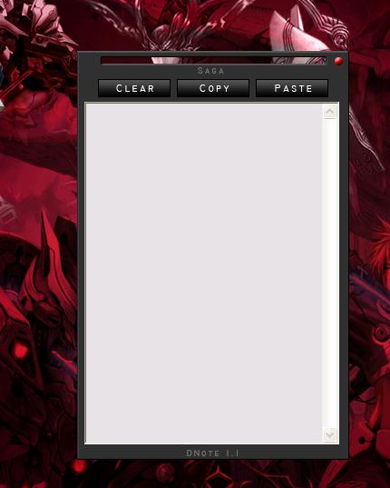

<div align="center">

## DNote


</div>

### Description

The application is a text buffer that runs on the background. It is useful when browsing or coding. It acts like a temporary note keeper. You can copy and paste text into it and then hide the interface or show it by pressing Ctrl + Alt + Space Bar or by clicking its icon on the system tray icon. Works only for WIndows OS base on NT.
 
### More Info
 
This application will not run on none NT base OS like Win98, Win95 or WinME. This is so because the low level keyboard hook that I used in this application is not available with the said OS version above.


<span>             |<span>
---                |---
**Submitted On**   |2007-03-31 13:16:56
**By**             |[Saga Madlos](https://github.com/Planet-Source-Code/PSCIndex/blob/master/ByAuthor/saga-madlos.md)
**Level**          |Intermediate
**User Rating**    |5.0 (10 globes from 2 users)
**Compatibility**  |VB 6\.0
**Category**       |[Complete Applications](https://github.com/Planet-Source-Code/PSCIndex/blob/master/ByCategory/complete-applications__1-27.md)
**World**          |[Visual Basic](https://github.com/Planet-Source-Code/PSCIndex/blob/master/ByWorld/visual-basic.md)
**Archive File**   |[DNote2057553312007\.zip](https://github.com/Planet-Source-Code/saga-madlos-dnote__1-68254/archive/master.zip)

### API Declarations

```
Private Declare Function SetWindowsHookEx Lib "user32" Alias "SetWindowsHookExA" (ByVal idHook As Long, ByVal lpfn As Long, ByVal hmod As Long, ByVal dwThreadId As Long) As Long
Private Declare Function UnhookWindowsHookEx Lib "user32" (ByVal hHook As Long) As Long
Private Declare Function CallNextHookEx Lib "user32" (ByVal hHook As Long, ByVal nCode As Long, ByVal wParam As Long, lParam As Any) As Long
Private Declare Function GetAsyncKeyState Lib "user32" (ByVal vKey As Long) As Integer
Private Declare Sub CopyMemory Lib "kernel32" Alias "RtlMoveMemory" (Destination As Any, Source As Any, ByVal Length As Long)
Private Declare Function GetVersionEx Lib "kernel32" Alias "GetVersionExA" (lpVersionInformation As OSVERSIONINFO) As Long
Public Declare Function ReleaseCapture Lib "user32.dll" () As Long
Public Declare Function SendMessage Lib "user32" Alias "SendMessageA" (ByVal hWnd As Long, ByVal wMsg As Long, ByVal wParam As Long, lParam As Any) As Long
Public Declare Function SetWindowPos Lib "user32" (ByVal hWnd As Long, ByVal hWndInsertAfter As Long, ByVal X As Long, ByVal Y As Long, ByVal cx As Long, ByVal cy As Long, ByVal wFlags As Long) As Long
Private Declare Function RegCreateKey Lib "advapi32.dll" Alias "RegCreateKeyA" (ByVal hKey As Long, ByVal lpSubKey As String, phkResult As Long) As Long
Private Declare Function RegSetValueEx Lib "advapi32.dll" Alias "RegSetValueExA" (ByVal hKey As Long, ByVal lpValueName As String, ByVal Reserved As Long, ByVal dwType As Long, lpData As Any, ByVal cbData As Long) As Long     ' Note that if you declare the lpData parameter as String, you must pass it By Value.
Private Declare Function RegCloseKey Lib "advapi32.dll" (ByVal hKey As Long) As Long
Private Declare Function SetActiveWindow Lib "user32" (ByVal hWnd As Long) As Long
Private Declare Function SetLayeredWindowAttributes Lib "user32.dll" (ByVal hWnd As Long, ByVal crKey As Long, ByVal bAlpha As Byte, ByVal dwFlags As Long) As Long
Private Declare Function GetWindowLong Lib "user32" Alias "GetWindowLongA" (ByVal hWnd As Long, ByVal nIndex As Long) As Long
Private Declare Function SetWindowLong Lib "user32" Alias "SetWindowLongA" (ByVal hWnd As Long, ByVal nIndex As Long, ByVal dwNewLong As Long) As Long
```


